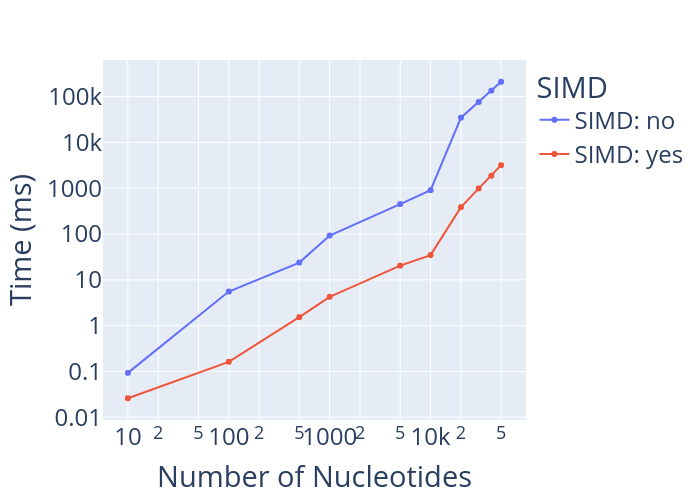

#  Portable SIMD Smith-Waterman

## Instructions

Follow these steps to clone the repository, build the necessary dependencies, and run the test:

### 1. Clone the Repository

First, clone the main repository:

```bash
git clone https://github.com/Raj-Bapat/SIMD-Smith-Waterman-Portable.git
```

### 2. Build Google Highway

Navigate to your tmp directory then clone the [Google Highway]([url](https://github.com/google/highway)) repository and build it:

```bash
cd /tmp/
git clone https://github.com/google/highway.git
cd highway
mkdir build && cd build
cmake ..
make -j
```

### 3. Build & Run

Navigate to your SIMD-Smith-Waterman-Portable directory and build it:

```bash
cd [your SIMD-Smith-Waterman-Portabledirectory]
make
./sw_test.out tests/t1.txt tests/q1.txt
```

## Usage

### How to run:

```bash

./sw_test.out [input file containing 1st DNA strand] [input file containing 2nd DNA strand]
```

### Settings:
```
	-v N    N is a positive integer that denotes the algorithm version (eg 1: brute force, 2: SIMD). [default: 2]
	-m N	N is a positive integer for weight match in genome sequence alignment. [default: 2]
	-x N	N is a positive integer. -N will be used as weight mismatch in genome sequence alignment. [default: 2]
	-o N	N is a positive integer. -N will be used as the weight for the gap opening. [default: 3]
	-e N	N is a positive integer. -N will be used as the weight for the gap extension. [default: 1]
```

## Performance


